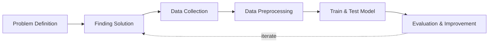

## Overview and Objective
This project marks the **next phase** in a multi-stage initiative that began with the development of a broker transaction data scraping system in 2022. With a solid foundation of historical broker transaction data already collected, the current focus is on building an **interactive analytics platform** to uncover **actionable insights** from that data.

The objective is to design and develop a **robust data analytics dashboard** capable of processing and analyzing broker transaction records from stock exchanges. This system will utilize **trend analysis, statistical modeling**, and **machine learning techniques** to reveal key insights such as:

* The impact of broker activity on **stock price movements**
* **Trading volume patterns** over time
* Behavioral **anomalies in broker transactions**
* Clustering brokers based on **activity similarities**

The platform will support both **historical data analysis** and **near-real-time monitoring**, enabling investors, financial analysts, and market researchers to better understand **market dynamics** and make **data-driven investment decisions**.

## Motivation and Inspiration
After successfully developing a scraping system to collect broker transaction data, the next logical step was to **turn raw data into insight**. While collecting the data provided access to critical information, meaningful patterns remained hidden in thousands of rows of unstructured records.

This project was inspired by the need to **empower users with a visual and analytical tool** that makes sense of complex broker behaviors. Drawing from my personal interest in **bandarmology** (broker-focused analysis), the project aspires to answer questions like:

* Which brokers are most influential in driving stock price trends?
* Are there coordinated buy/sell patterns across certain brokers?
* Can historical broker behavior help predict short-term market moves?

The ultimate goal is to build a **comprehensive broker analytics dashboard** that not only enhances research but also supports **smarter, faster, and more confident trading decisions** through powerful data visualizations and insights.

## Workflow
Below is the workflow on how my project works

1. Problem Definition
   - Clearly define the problem that needs to be solved.

2. Finding Solution
   - List all potential solutions and choose one for implementation.  
   - Develop a plan outlining the expected outcomes.

3. Data Collection
   - Gather and prepare relevant datasets aligned with the problem.  
   - If batch datasets are unavailable, develop a data collection process such as web scraping.  
   - Ensure data quality and resolve any data issues.

4. Data Preprocessing
   - Handle missing data or outliers.  
   - Clean and structure the data.  
   - Perform data transformation.  
   - Store data appropriately.  
   - Backup the data.

5. Continuous Update
   - Regularly update the dataset or as needed.

6. Data Visualization & Analysis
   - Univariate analysis - (numerical data): Use histograms, box plots, and density plots to understand distributions.  
   - Univariate analysis - (categorical data): Use bar charts or pie charts to observe category frequencies.  
   - Bivariate analysis: Analyze relationships between two variables.  
   - Multivariate analysis: Examine interactions between three or more variables, often visualized with pair plots or heatmaps.

7. Evaluation & Improvement
   - Evaluate inputs, processes, outputs, and outcomes.  
   - Identify challenges.  
   - Gain insights.  
   - Implement necessary improvements by addressing challenges, adding new features, or refining results based on evaluation feedback.  
   - Develop a plan for future enhancements.
     

## Solution and Technology Stack
Used tools:
1. Python libraries: TensorFlow, OpenCV, scikit-learn, NumPy, labelImg2. Hardware : Laptop Acer Predator Helios 300, Intel-12700H, 48 GB Ram, Gen4 SSD, RTX3070Ti Laptop GPU, 8 GB Vram

## Project Details and Results
1. Data Transformation

   In this section, I focus on transforming raw data into numerical data, enabling effective calculations and analysis.
   - Transform data to new format, by leveraging 
   
     
     
- Result example
     
     
     
- Merging all dataset, from daily dataset to ticker dataset
     
     
     
2. Setup SQL Server

   In this section, I perform setup to create and upload all dataset to SQL server
   - Creating SQL server
     
     
     
- Uploading dataset to SQL server
     
     
     
- Result and preview
     
     

       
       
     

     
3. Data Visualization

   For now, I am only using Plotly and Streamlit to create simple data visualizations.\
   
   

## Challenges
1. **Volume and Complexity of Data:** Analyzing large datasets of broker transactions, which include complex patterns, relationships, and varying levels of detail, requires robust data processing and analytical methods.
2. **Scalability Issues:** As data volume increases, the system must be efficiently scaled to handle storage and processing without a decline in performance.
3. **Computational Resource Constraints:** Analyzing complex datasets often requires significant computational power, necessitating investments in high-performance computing resources.
4. **Real-Time Processing Requirements:** The need for real-time analysis adds complexity to the data processing workflow, requiring advanced architecture to efficiently handle streaming data.
5. **Data Integration:** Integrating data from various exchanges and ensuring consistency and uniformity across datasets is essential for accurate analysis.
6. **Variability in Data Quality:** Differences in data quality across sources can complicate integration efforts, requiring additional validation and cleaning steps to ensure consistency.
7. **Identifying Relevant Patterns:** Distinguishing between noise and actionable patterns in the data is challenging, particularly given the complexity and variability of stock market activities.

## Insights
1. **Broker Influence Analysis:** Analyzing transaction data enables the understanding of how each broker affects stock prices and market movements, providing crucial insights for both short-term traders and long-term investors.
2. **Correlation with Price Movements:** By establishing correlations between specific broker trading volumes and subsequent price movements, analysts can identify which brokers exert the greatest influence on particular stocks.
3. **Volume vs. Impact Analysis:** Examining the relationship between trading volume and market impact can help determine the threshold at which broker activity significantly affects stock prices.
4. **Market Trend Identification:** The system can identify emerging trends and shifts in the market based on aggregate broker activity, assisting users in discovering opportunities and risks early.
5. **Sentiment Analysis Integration:** Combining sentiment analysis from news and social media with transaction data can enhance trend identification by providing context for broker activities, though this sentiment primarily originates from external news sources.
6. **Behavioral Patterns:** Analysis can reveal patterns in broker behavior, such as recurring trading strategies, which may indicate market sentiment or potential manipulation.
7. **Historical Trend Comparison:** Comparing current broker activity with historical data can uncover cyclical patterns, helping traders recognize whether current trends are temporary or indicative of long-term shifts.
8. **Order Flow Analysis:** Understanding specific broker order flows can provide insights into their strategies, such as whether they are accumulating or distributing particular stocks, which may influence market sentiment.
9. **Buyer vs. Seller Pressure:** Detailed order flow analysis can help differentiate between buyer and seller pressure, offering insights into market sentiment and potential future price movements.
10. **Order Timing:** Analyzing large order timings can reveal strategic intents, such as whether brokers are attempting to build positions or liquidate shares, which impacts trading strategies.

## Future Plans
1. **Advanced Predictive Models:** Implement more sophisticated predictive models using machine learning algorithms to forecast future broker behaviors based on historical transaction data.
2. **Event Alert System:** Develop an automated alert system to notify users of significant market events or unusual broker activities as they occur.
3. **Clustering Analysis for Broker Behavior:** Apply clustering algorithms to group brokers based on their trading behaviors, enhancing understanding of market dynamics.
4. **AI-Based Insights:** Create AI-driven analytical tools to automatically identify significant market events, such as sudden changes in trading volume or price movements influenced by specific brokers.
5. **Natural Language Processing (NLP):** Utilize NLP techniques to analyze accompanying text data, such as news articles or broker comments, to assess sentiment and its impact on trading.
6. **Feedback Mechanism for Model Improvement:** Establish a feedback loop where prediction outcomes can be evaluated and used to continuously refine machine learning models.
7. **Cross-Market Correlation:** Expand the analytical platform to compare broker transactions across different stock markets, identifying cross-market patterns and broader global trends.

## Real World Use Cases
1. **Retail Investor Decision Support:** Retail traders can use the dashboard to observe which brokers are driving volume or initiating large buy/sell orders, helping them **identify institutional accumulation or distribution**. This insight enables retail investors to align their strategies with dominant market players or avoid unfavorable positions.
2. **Early Detection of Market Manipulation:** By identifying anomalies in broker activity—such as abrupt shifts in net buying/selling patterns or repeated suspicious volume spikes—the platform can help detect **pump-and-dump schemes or coordinated trading**, assisting both independent traders and regulatory bodies.
3. **Backtesting and Strategy Optimization:** Investors and quant traders can use historical broker behavior data to **backtest Bandarmology-based trading strategies**, adjusting filters based on broker type, trading patterns, or behavioral indicators to optimize returns.
4. **Trend Forecasting and Sentiment Analysis:** The system can reveal **short-term and long-term market sentiment** by tracking how key brokers interact with specific sectors or stocks. For instance, a consistent buying pattern by foreign brokers may signal bullish sentiment, offering investors an edge.
5. **Quantitative Research for Analysts and Financial Institutions:** Research analysts can conduct **statistical modeling and correlation studies** between broker activity and stock performance, enriching market reports with unique datasets not available through standard financial APIs.
6. **Real-Time Alerts for High-Impact Activity:** The dashboard can be equipped with **trigger-based alerts** when specific brokers suddenly become top buyers or sellers in a particular stock, giving traders a tactical advantage in making timely entry or exit decisions.
7. **Investor Education and Strategy Training:** Educators and mentors can use the dashboard as a **live teaching tool** to help students and novice traders learn how broker behaviors influence markets, using real data to illustrate market dynamics and strategy evaluation.
8. **Market Intelligence for Small Portfolio Managers:** Independent portfolio managers can integrate the dashboard into their research workflow, gaining **broker-level insights without the need for costly Bloomberg terminals or proprietary datasets**, thereby leveling the playing field.
9. **Comparative Stock Analysis Based on Broker Behavior:** Users can compare the behavior of brokers across different stocks or sectors to identify **emerging investment opportunities**, such as when certain brokers begin entering undervalued or less-followed stocks.
10. **Supporting Regulatory Oversight and Transparency:** Regulators or watchdog organizations can use the tool for **compliance monitoring**, analyzing transaction trends to ensure that market behavior aligns with fair-trading principles and to investigate irregular activities.
