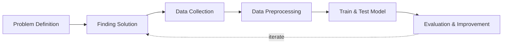

## Overview and Objective
This project, **initiated in 2021**, focuses on developing a **web scraping system** that automates the extraction of **broker transaction data** from the Indonesian stock exchange. The system is designed to collect detailed records of broker activity, including **trading volume, buy/sell transactions**, and other relevant metrics. By organizing this data into a structured format, the system serves as a powerful tool for **analyzing broker behavior and understanding market dynamics**.

The core objective is to build a **scalable and automated solution** for collecting broker transaction data. The extracted data will form the foundation of a **retrospective broker activity database**, enabling deeper insight into **trading patterns, investor sentiment, and institutional behavior**. While this project's scope is currently limited to data collection, it lays the groundwork for advanced analysis and visualization in future development.

## Motivation and Inspiration
As an investor in the **Indonesian stock market**, I quickly discovered that **price movement predictions cannot rely solely on technical or fundamental analysis**. In search of alternative strategies, I came across the book *Bandarmology* by **Ryan Filbert**, which introduced me to the concept of **broker-based analysis**—or *brokermology* in English.

This approach focuses on monitoring **broker transactions** (buy/sell activities) to understand hidden patterns and behaviors that influence stock prices. Brokers may represent **retail traders, institutional investors, foreign entities, or market makers**, making their behavior an insightful proxy for understanding market sentiment.

At the same time, I recognized the growing need to **collect and manage large-scale datasets** from the web. Broker transaction data, while publicly available for transparency, is **not provided in exportable formats**—only as **HTML tables**. Manually copying this data is **tedious and inefficient**, especially for retrospective analysis.

This project was born out of the need to **automate** this process. By developing a scraping system, I aimed to make **broker transaction data more accessible, organized, and usable** for both personal insights and broader research purposes. Ultimately, the project supports **smarter, data-driven investment decisions** and encourages **innovative analysis techniques** within financial markets.

## Workflow
Below is the workflow on how my project works

1. Problem Definition
   - Clearly define the problem that needs to be solved.

2. Finding Solution
   - List all potential solutions and select one for implementation.  
   - Develop a plan that outlines the expected outcomes.

3. Data Collection
   - Gather and prepare relevant datasets aligned with the problem.  
   - If batch datasets are unavailable, develop a data collection process like web scraping.  
   - Ensure data quality and resolve any data issues.

4. Continuous Updates
   - Regularly update the dataset or as needed.

5. Evaluation & Improvement
   - Evaluate inputs, processes, outputs, and outcomes.  
   - Identify challenges.  
   - Gain insights.  
   - Implement necessary improvements by addressing challenges, adding new features, or refining results based on evaluation feedback.  
   - Develop a plan for future enhancements.
  

## Solution and Technology Stack
Used tools:
1. Python libraries: TensorFlow, OpenCV, scikit-learn, NumPy, labelImg2. Hardware : Laptop Acer Predator Helios 300, Intel-12700H, 48 GB Ram, Gen4 SSD, RTX3070Ti Laptop GPU, 8 GB Vram

## Project Details and Results
1. Data Collection Automation

   There is a platform that provides daily broker transaction data, which I use for data mining. Previously, I employed a **multi-threaded bot setup with 20 bots running simultaneously** to gather data. However, due to platform limitations and website designe changes, I **currently use a 10 bots** for data extraction. While I won't be sharing screenshots of my code for various reasons, I am happy to showcase the results. The primary goal of this bot is to collect and extract tabular transaction data from HTML and save it as CSV files.

   
   
To date, I have gathered approximately 1 million plus of CSV files using my bot, which has been mining transaction data since 2017.
   
   
   
3. Completion Data Check
   - Identifying Missing Files: Locating any files that were not downloaded successfully.
     
     
     
- Verifying File Content: Checking whether the CSV files contain transaction data, as there are instances where my bot fails to write data correctly (possibly due to an error).
     
     
     
- Detecting Empty Files: Identifying empty CSV files by inspecting their file sizes.
     
     
     
4. Data Validation
   - Collect Original Summary Data: Retrieve the original summary data from my broker platform for comparison.
     
     
     
- Summarize Daily Transaction Data: Aggregate all daily transaction data through an extensive calculation process.
     
     
     
- Identify Data Discrepancies: Compare the summary data to identify and correct any data errors.
     
     

       
       
     

     
5. Recollecting Data to be Revised
   - Manual Data Analysis: Manually analyze the compared transaction summary data in Excel, using it as a reference for refining the bot.
     
     
     
- Re-running the Bot: Run the bot to re-collect data, where it will scan for files smaller than 40 bytes and automate the re-download process.
     
     

       
       
     

     
- Iterative Refinement: Repeat this process, comparing results each time to minimize data discrepancies and achieve the lowest margin of error.

     

## Challenges
1. **Data Volume and Frequency:** Broker transactions are vast and frequent, posing challenges in efficiently collecting, processing, and storing large volumes of data.
2. **Data Quality:** Ensuring that the collected data is accurate, complete, and consistent.
3. **Website Changes:** Adapting to changes in website structure and data formats, which can impact the data collection process and require ongoing maintenance.

## Insights
1. **Real-Time Monitoring:** Collecting broker transaction data in near real-time provides valuable insights into market sentiment and trading trends as they unfold.
2. **Predictive Analytics:** Continuous data collection supports the development of predictive models that forecast short-term market movements based on broker activity patterns.
3. **Market Behavior Insights:** By gathering broker-specific transaction data, analysts can gain a deeper understanding of how certain brokers influence price movements and trading volumes.
4. **Data Enrichment:** Automated processes can enhance collected data by integrating additional information, such as stock fundamentals or news sentiment, providing a more comprehensive view for analysis.
5. **Automated Data Processing:** Integrating automated data cleaning and organization processes ensures that collected data is ready for analysis, minimizing the need for manual intervention.
6. **Scalability and Efficiency:** Automated data flows ensure scalability, allowing the system to efficiently handle large volumes of data from various sources without manual input.

## Future Plans
1. **Expanding Data Coverage:** Enhance the scraping system to include additional global exchanges and related financial data, providing a more comprehensive dataset for analysis.
2. **Incorporating Alternative Data Sources:** Include data from social media, financial news, and sentiment analysis to enrich the dataset and provide context for broker transactions.
3. **Adding Historical Data:** Implement mechanisms to scrape and archive historical transaction data, enabling longitudinal analysis and trend identification over time.
4. **Expanding Asset Classes:** Broaden the scope to include transactions related to various asset classes, such as derivatives, commodities, and cryptocurrencies, allowing for a more holistic view of market behavior.
5. **Enhancing Real-Time Capabilities:** Develop systems for real-time scraping and processing, enabling timely analysis of current broker transactions.
6. **Interactive Dashboards:** Create interactive dashboards that allow users to filter and explore specific broker transactions, providing deeper insights and customized views.

## Real World Use Cases

1. **Broker Behavior Analysis for Retail Traders:** By automating broker transaction data collection, the system allows individual traders to observe broker-specific buy/sell behavior in real time or retrospectively. This can help identify patterns such as accumulation, distribution, or sudden volume spikes—essential in the **Bandarmology** strategy for identifying "smart money" activity.
2. **Foreign vs. Domestic Investor Sentiment Tracking:** The dataset can be used to classify brokers by type (foreign vs. local) and analyze their influence on price movement. This helps traders and analysts infer broader market sentiment, e.g., when foreign brokers are accumulating positions in blue-chip stocks, it may suggest upcoming institutional movement.
3. **Development of Custom Trading Indicators:** The structured data can serve as a foundation for building **technical indicators** that incorporate broker activity. For example, custom scripts or dashboards could display “Top 5 Net Buyers” vs. “Top 5 Net Sellers” to support trading decisions.
4. **Support for Quantitative and Algorithmic Trading Strategies:** Systematic traders can use the broker transaction data to build quantitative models that backtest how specific broker actions correlate with price changes. For example, they could design entry/exit signals based on broker dominance thresholds or behavior-based filters.
5. **Enhanced Visualization and Dashboarding for Financial Analysts:** The scraped data can be integrated into Power BI, Tableau, or Python dashboards to visualize trends in broker activity over time. This helps analysts spot recurring behaviors, market manipulation attempts, or identify brokers consistently linked to pump-and-dump patterns.
6. **Market Sentiment and Manipulation Detection for Compliance Teams:** For regulators or compliance officers, this data is useful in flagging suspicious broker activity, such as wash trades, spoofing, or coordinated buying/selling. It supports transparency and improves market integrity.
7. **Educational Resource for Teaching Behavioral Finance:** Academic instructors or financial educators can use the collected broker data to demonstrate real-world examples of herd behavior, information asymmetry, or institutional influence in stock markets.
8. **Backtesting for Bandarmology-Based Strategies:** Investors and students of Bandarmology can use the historical broker transaction database to **simulate trades** and evaluate how effective the approach would have been under different market conditions.
