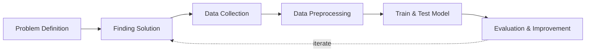

## Overview and Objective
This project, developed in **2021**, harnesses the power of **computer vision and deep learning techniques** to detect **Covid-19 from chest X-ray (CXR) images**. By training a model on a **carefully curated dataset of labeled medical images**, the objective is to **classify these images as either positive or negative for Covid-19**. This initiative aspires to provide a **faster and more automated diagnostic tool**, empowering **medical professionals to identify Covid-19 cases with remarkable accuracy**, complementing traditional testing methods.

The **primary aim** of this project is to create an **AI-powered system** capable of **swiftly and accurately detecting Covid-19 from medical images**. This tool is designed to **enhance diagnostic efficiency**, **reduce reliance on resource-intensive testing methods**, and potentially **broaden access to diagnostic capabilities** in areas with **limited healthcare infrastructure**. By bridging **technological innovation** with **healthcare needs**, we strive to **contribute meaningfully to the global fight against Covid-19**.


## Motivation and Inspiration
The global **Covid-19 pandemic** has highlighted the **urgent need for rapid and accurate diagnostic tools**, exposing the **limitations of traditional testing methods** like **PCR tests**, which, while effective, often require **significant time and resources**. **Delays in testing** and **slow result turnaround** emphasize the necessity for **alternative approaches** that can provide **timely insights**.

This reality has inspired me to explore the **transformative potential of AI and computer vision** in developing **more accessible diagnostic methods** through the analysis of **CXR or CT scans**. By leveraging **deep learning models**, my goal is to create a system that assists **healthcare professionals in the early detection of Covid-19**, significantly **accelerating the diagnostic process**.

Such advancements can not only **alleviate the burden on healthcare systems** but also **enhance screening efficiency**, particularly in **resource-limited areas** where access to traditional testing is constrained. Furthermore, the **integration of AI-driven diagnostic tools** can lead to **better patient outcomes** by enabling **quicker interventions** and more **effective resource allocation**. Ultimately, this project aims to **democratize healthcare** by providing **advanced diagnostic capabilities to a broader population**, fostering a **more resilient and responsive healthcare infrastructure** in the face of **future public health challenges**.


## Workflow
Below is the workflow on how my project works



1. Problem Definition
   - Clearly define the problem that needs to be solved.

2. Finding Solutions
   - List all potential solutions and choose one to implement.
   - Set objectives (e.g., classification accuracy, minimizing prediction errors) and constraints (e.g., time, hardware limitations).  
   - Create a plan outlining the expected outcomes.

3. Data Collection
   - Gather and prepare a relevant dataset aligned with the problem.

4. Data Preprocessing
   - Split the data into training, validation, and test sets.  
   - Perform labeling or annotation where necessary.

5. Train & Test Model
   - Choose a deep learning model architecture based on the problem (e.g., CNN for images, RNN/LSTM for sequential data, Transformer for NLP).    
   - Train the model, setting targets for accuracy, loss, and other performance metrics.  
   - Test the model using the test dataset to evaluate its performance.  
   - Conduct real-world testing with external datasets to ensure the model's accuracy and applicability.

6. Evaluation & Improvement
   - Evaluate inputs, processes, outputs, and outcomes.  
   - Identify challenges.  
   - Discover insights.  
   - Make necessary improvements by addressing challenges, adding new features, or refining results based on evaluation feedback.  
   - Set a plan for future developments.


## Solution and Technology Stack
Used tools:
1. TensorFlow Object Detection API
2. Pretrained Model
3. Python libraries: TensorFlow, OpenCV, scikit-learn, NumPy, labelImg4. Hardware : Laptop Acer Predator Helios 300, Intel-12700H, 48 GB Ram, Gen4 SSD, RTX3070Ti Laptop GPU, 8 GB Vram


## Project Details and Results
This project is designed to detect only two categories: `Covid-19 positive` and `Covid-19 negative`.

1. Data Collection
   
   The dataset utilizing Covid-19 Radiography. I have used only **800 images** as a sample, comprising **400 images** for each category, which is considered sufficient for detecting two object categories.

2. Labelling

   Image labeling using LabelImg in Python involves manually annotating images by drawing bounding boxes around objects of interest and saving the coordinates and class labels in XML.

   
   
3. Generate Training Records

   TFRecords generation in Python involves converting datasets, such as images and annotations, into a serialized binary format optimized for TensorFlow, enabling efficient data storage and access during model training and evaluation.
   ```sh
   import pathlib

   MAIN_PATH = str(pathlib.Path().resolve())
   WORKSPACE_PATH = MAIN_PATH + "\\workspace"
   SCRIPTS_PATH = MAIN_PATH + "\\scripts"
   ANNOTATION_PATH = WORKSPACE_PATH + "\\annotations"
   IMAGE_PATH = WORKSPACE_PATH + "\\images"
   ```

   ```sh
   labels = [
     {"name" : "covid_19_negative", "id" : 1},
     {"name" : "covid_19_positive", "id" : 2}
   ]

   with open(ANNOTATION_PATH + "\label_map.pbtxt", "w") as f:
       for label in labels:
           f.write("item { \n")
           f.write("\tname:\"{}\"\n".format(label["name"]))
           f.write("\tid:{}\n".format(label["id"]))
           f.write("}\n")
   ```

   ```sh
   !python {SCRIPTS_PATH + "\\generate_tfrecord.py"} -x {IMAGE_PATH + "\\train"} -l {ANNOTATION_PATH + "\\label_map.pbtxt"} -o {ANNOTATION_PATH + "\\train.record"}
   !python {SCRIPTS_PATH + "\\generate_tfrecord.py"} -x {IMAGE_PATH + "\\test"} -l {ANNOTATION_PATH + "\\label_map.pbtxt"} -o {ANNOTATION_PATH + "\\test.record"}
   ```
   

   
4. Training Model using TensorFlow OD API
   - The TensorFlow object detection API was downloaded from this repository: [TensorFlow Models](https://github.com/tensorflow/models/tree/master/research/object_detection).
   - The pre-trained models were downloaded from this repository: [TF2 Detection Model Zoo](https://github.com/tensorflow/models/blob/master/research/object_detection/g3doc/tf2_detection_zoo.md).
   
   In this section, the dataset was trained to detect 2 categories as an object, and the trained model was saved by following these steps:
   - Generate the training command using this code.

     ```sh
      APIMODEL_PATH = "\\TensorFlow\\models" # set up your own path
      WORKSPACE_PATH = MAIN_PATH + "\\workspace"
      MODEL_PATH =  WORKSPACE_PATH + "\\models"
      CUSTOM_MODEL_NAME = "my_ssd_mobnet" # used pre-trained model
      n = 5000
      ```
      
      ```sh
      print("""python {}\\research\\object_detection\\model_main_tf2.py --model_dir={}\\{} --pipeline_config_path={}\\{}\\pipeline.config --num_train_steps={}""".format(APIMODEL_PATH, MODEL_PATH, CUSTOM_MODEL_NAME, MODEL_PATH, CUSTOM_MODEL_NAME, n))
      ```

   - Copy and paste the training command into the command prompt, then press enter to start the training process.

     
     
- Training process

     
     
- Once training is complete, you can check the trained model as shown below. This model can be used to perform various detection tasks.

     
     
5. Detection Test

   The actual testing will use images different from those used in training. In this step, the code will attempt to detect 1,000 images, generating bounding boxes, labels, and detection scores on the images. You can review the detection results below.

   

   


## Challenges
1. **Data Availability**: Accessing large and high-quality datasets of Covid-19 medical images can be challenging due to privacy and ethical concerns.
2. **Image Quality and Variability**: Medical images often differ significantly in quality, resolution, and positioning, making it difficult for models to generalize effectively.
3. **Model Generalization**: Ensuring that the model performs accurately across diverse populations, hospitals, and imaging equipment is crucial for real-world applications.


## Insights
1. **Transfer Learning**: Leveraging pre-trained models significantly enhances performance when working with limited medical image data.
2. **Importance of Features**: By analyzing the areas of the images that the model focuses on, insights can be gained regarding which regions of the lungs are most indicative of COVID-19 infection.
3. **Collaboration with Experts**: Engaging with radiologists and healthcare professionals enriches the annotation process and aids in interpreting the model's outputs within a clinical context.


## Future Plans
1. **Expand the Dataset**: Plan to collaborate with healthcare institutions to gather a more diverse and comprehensive dataset, including images from various stages of infection.
2. **Implement as a Web Application**: Develop a web-based tool (using frameworks like Streamlit) to make the detection model accessible to healthcare professionals in real time.
3. **Multimodal Diagnosis**: Integrate additional diagnostic data (such as patient symptoms and demographic information) to enhance the overall accuracy and robustness of the model.


## Real World Use Cases
1. **Accelerating Covid-19 Screening in Clinical Settings:** This AI-powered tool serves as a supportive assistant to healthcare professionals by rapidly analyzing chest X-rays to flag potential Covid-19 cases. It helps prioritize urgent cases and streamline workflows, enabling medical staff to focus their expertise where it matters most.
2. **Enhancing Diagnostic Capacity in Resource-Limited Areas:** By providing an automated, accessible method for preliminary Covid-19 detection, this system extends diagnostic capabilities to regions with limited access to PCR testing or specialized radiologists, fostering greater equity in healthcare delivery.
3. **Complementing Traditional Testing Methods:** Rather than replacing existing diagnostic standards, this model acts as a complementary technology, offering faster insights that can guide timely decision-making while waiting for confirmatory lab results, thus bridging technology and medicine.
4. **Supporting Pandemic Preparedness and Response:** The framework developed here can be adapted for rapid deployment in future public health crises, enabling early detection of respiratory illnesses through imaging, and helping healthcare systems respond more resiliently and proactively.
5. **A Step Toward Democratizing Healthcare Through AI:** By empowering clinicians with advanced tools that enhance accuracy and speed, this project reflects a vision where technology amplifies human judgment and compassion—working hand in hand to deliver better outcomes and broaden access to quality care.
