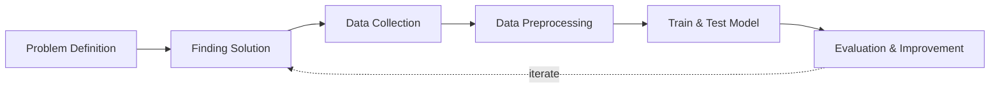

## Overview and Objective
This project, **developed from 2022 to the present**, aims to **advance facial recognition on a larger scale** by creating a **sophisticated model capable of identifying and verifying thousands of faces**. By leveraging **deep learning techniques**, the model seeks to deliver **accurate and efficient facial recognition** across various environments. The **primary goal** is to create a **scalable solution** and a **fully functional deep learning workflow** that can enhance **CNN (Convolutional Neural Network) projects** and any **computer vision applications**.

The project's objective is to develop a **robust facial recognition model** that can **accurately recognize and verify thousands of faces**, designed to **manage a large-scale facial database** while ensuring **high accuracy**.

## Motivation and Inspiration
This facial recognition project is inspired by the **remarkable capabilities of the human eye and brain**, which can effortlessly **detect and recognize multiple objects and faces simultaneously**. Research indicates that the **human brain can recognize an average of 5,000 faces and remember up to 10,000**. Leveraging this understanding, the project aims to **harness the transformative potential of facial recognition technology** to **revolutionize various industries**.

**Traditional facial recognition methods** often face **challenges with scalability and accuracy** when dealing with **large datasets**. By integrating **rapid advancements in deep learning**, this project seeks to develop a **robust system capable of accurately handling and identifying thousands of faces**.

**Project Reference**
- [Facial Recognition - Small Version](https://azzindani.github.io/docs/page4.html)

## Workflow
Below is the workflow on how my project works

1. Problem Definition
   - Clearly define the problem that needs to be solved.

2. Finding Solutions
   - List all potential solutions and select one for implementation.  
   - Set objectives (e.g., classification accuracy, minimizing prediction errors) and constraints (e.g., time, hardware limitations).  
   - Develop a plan that outlines the expected outcomes.

3. Data Collection
   - Gather and prepare relevant datasets aligned with the problem.  
   - If batch datasets are unavailable, develop a data collection process like web scraping.

4. Data Preprocessing
   - Clean and sort relevant datasets.  
   - Handle missing data or outliers.  
   - Perform data augmentation.  
   - Split the data into training, validation, and test sets.

5. Model Building
   - Select a deep learning model architecture based on the problem (e.g., CNN for images, RNN/LSTM for sequential data, Transformer for NLP).  
   - Configure layers (convolutional, dense, recurrent, etc.), activations, and connectivity.  
   - Choose an optimizer (e.g., Adam, SGD, RMSProp).  
   - Set hyperparameters such as learning rate, batch size, and number of epochs.

6. Train & Test Model
   - Train the model, setting targets for accuracy, loss, and other performance metrics.  
   - Test the model using the test dataset to evaluate its performance.  
   - Inspect feature maps and filters.  
   - Conduct real-world testing with external datasets to ensure the model's accuracy and applicability.

7. Fine-Tuning
   - Hyperparameter Tuning: Adjust learning rate, batch size, number of layers, etc., to enhance performance.  
   - Regularization: Apply techniques like dropout, weight decay, or L2 regularization to avoid overfitting.  
   - Transfer Learning: Fine-tune pre-trained models on new datasets if the original task is similar.

8. Evaluation & Improvement
   - Evaluate inputs, processes, outputs, and outcomes.  
   - Identify challenges.  
   - Gain insights.  
   - Implement necessary improvements by addressing challenges, adding new features, or refining results based on evaluation feedback.  
   - Develop a plan for future enhancements.

## Solution and Technology Stack
Used tools:
1. Python libraries: TensorFlow, OpenCV, scikit-learn, NumPy, labelImg2. Hardware : Laptop Acer Predator Helios 300, Intel-12700H, 48 GB Ram, Gen4 SSD, RTX3070Ti Laptop GPU, 8 GB Vram

## Project Details and Results
1. Data Collection

   I encountered difficulties in collecting data through Kaggle.com, so I developed a solution by **creating an automation bot**. This bot, built using the Selenium module, was designed to gather facial images by using celebrity names as keywords. It browses Google Images and downloads the desired **number of images (100 per keyword)**. To speed up the data collection process, I implemented multi-threading, **running 10 bots simultaneously**, each with different keywords.

   For the initial data collection, **I used 1,898 celebrity names as keywords**, **collecting approximately 178,934 image** files organized into folders based on the keywords, developed in 2022.

   
   
**The latest data collection update has been prepared for 10,000 keywords, gathering over 1 million images. Currently, more than 500,000 images and over 9,000 keyword folders remain to be processed.**

   
   
2. Cropping Images

   I cropped all the images using OpenCV with the Haar Cascade method.

   

     
     
   

   
3. Data Cleaning
   - At this stage, I had to manually verify whether the collected facial images were correct, as sometimes they included pictures of other people. I needed to remove any faces that did not match the criteria.
  
     
     
- In this step, I counted the cropped images to ensure that the samples were filled with heterogeneous images. Each folder of cropped images needed to contain 30 images; once a folder met this requirement, my code would copy the images to another directory.
  
     
     
- For this step, each folder of images needed to contain 50 sample images. I created code to populate new folders with 50 images. If the source already contained more than 50 images, only 50 images would be copied to the new folder; if the source had fewer than 50 images, images would be duplicated until the new folder contained 50 images.
     
     
     
Currently, **I have collected over 1,000 celebrity faces** that are ready for model training. I still have **more than 4,000 celebrity faces** that need to be cleaned and processed.
   - Samples to be used for training

     
     
- **Remaining dataset for future development**

     
     
4. Data Augmentation

   To increase the quantity of images and obtain more samples, I needed data augmentation to expand the dataset. Here's an example of data augmentation techniques to **multiply 50 images in each folder into 500 images** per folder.

   
   
The result

   

     
     
   

   
5. Training Model

   I have rigorously trained multiple times to ensure the capabilities of this deep learning algorithm with varying samples of faces and images.

   
   
For instance, I will demonstrate using a dataset of **1000 unique faces, each with 100 images**, as follows:
   - I loaded these samples into an **array with 96 x 96 pixel dimensions** as my input tensor, encompassing 100,000 samples. In this scenario, the input tensor consists of celebrity face images, while the **output tensor represents 650 celebrity names**.

     

       
       
     

     
- I **utilized 100,000 images as my dataset**, partitioning it into **70,000 images for training (70%)**, **20,000 images for testing (20%)**, and **10,000 images for validation (10%)**. The deep learning **CNN models will use 28 million trainable parameters**.

     
     
- I set an **accuracy threshold of 0.97 or 97%** to halt the training process, **achieving 231 epochs** in the process.

     

       
       
     

     
- Upon **testing with the validation** samples, the model **achieved an accuracy of 0.97 or 97%**.

     
     
6. Filter & Feature Map Check
   - Here are the filters generated by this deep learning model.

     
     
- Here are the feature maps produced by this deep learning model.

     
     
7. Testing Trained Model

   I created test demonstration images as a benchmark for evaluating the true accuracy of my model.

   
   
The results indicate that I achieved authentic face recognition, though not perfectly, as illustrated in the screenshot below. You can observe that the face images serve as the input tensor, while the filenames represent the output tensor from the detection.

   

     
     
   

## Challenges
1. **Web Scraping Duration:** Increasing the number of faces significantly extends the data collection time.
2. **Network Challenges:** Network limitations can impact image data quality and potentially cause system crashes. Therefore, I need to limit the number of bots running the process.
3. **Data Cleaning:** This process will be carried out manually, verifying whether the downloaded images match their labels.
4. **Hardware Limitations:** An increase in the number of faces and model parameters demands greater hardware capacity.
5. **Scalability:** Managing and processing large datasets of facial images while maintaining high performance, model scalability, and accuracy.
6. **Varied Conditions:** Addressing variations in lighting, facial expressions, and angles to ensure reliable recognition across diverse environments.
7. **Model Training:** Training the model with a diverse and comprehensive dataset to prevent bias and ensure the model generalizes well to unseen faces.

## Insights
1. **Parallel Processing:** Techniques like parallel computing can enhance performance by executing multiple operations simultaneously.
2. **Convolutional Neural Networks (CNN):** CNNs are vital for extracting complex features from facial images. They can automatically learn hierarchical features, such as edges, textures, and patterns, from raw pixel data. In facial recognition, deeper CNN layers capture high-level features like facial shapes, eyes, and noses.
3. **Data Augmentation:** Implement augmentations such as rotation, scaling, brightness adjustments, and random cropping to simulate variations in facial orientation and lighting conditions.
4. **Transfer Learning:** Transfer learning is a machine learning technique where knowledge gained from one task or dataset is leveraged to improve model performance on related tasks and/or different datasets.
5. **Multiscale and Multiview Features:** To address variations in facial expressions, skin tones, feature sizes, angles, and lighting, extracting features at multiple scales and viewpoints can significantly improve recognition accuracy.
6. **GPU Acceleration:** Graphics Processing Units (GPUs) significantly speed up the training and inference processes for deep learning models.
7. **System Optimization:** Regular optimization and updates of algorithms and hardware are essential to maintain real-time performance as the system scales.

## Future Plans
1. **Enhance Accuracy:** Continuously refine the model by incorporating advanced deep learning techniques and expanding the dataset to improve recognition accuracy and robustness.
2. **Integration with Applications:** Develop integration solutions for various applications, such as security systems, personalized services, and enhanced customer experiences.
3. **Scalable AI Solutions:** Leverage AI platforms that offer scalable and flexible solutions, allowing you to adjust resources on demand.
4. **Scalable Infrastructure:** Build a scalable infrastructure capable of handling growing datasets and user demands, including cloud-based solutions and distributed processing.
5. **Boost Recognition Performance:** Keep enhancing the model by implementing more sophisticated deep learning techniques and expanding the dataset to strengthen accuracy and recognition resilience.

## Real-World Use Cases

1. **Nation-Scale Identity Authentication Systems:** This model can support the development of secure and efficient national identification systems, enabling governments to streamline services such as digital ID verification, passport control, and e-voting, while enhancing accessibility and reducing identity fraud.
2. **Large-Scale Attendance and Access Management:** Educational institutions, corporate campuses, or public events with thousands of participants can benefit from automated attendance systems that identify individuals in real-time, reducing bottlenecks and administrative overhead while ensuring security.
3. **Smart City Infrastructure:** As cities adopt AI technologies, this model could help enable intelligent surveillance systems that support public safety, monitor crowd density, or assist in emergency responses—while adhering to ethical guidelines for privacy and fairness.
4. **Humanitarian Aid and Disaster Response:** In large-scale disaster situations, refugee registration camps, or crisis zones, this model can aid in verifying identities to ensure equitable distribution of aid, support family reunification efforts, and track population movements responsibly.
5. **Enhancing Financial and E-Commerce Security:** High-volume financial platforms or digital wallets can integrate facial recognition for secure customer verification, providing an additional layer of protection for transactions while improving user convenience.
6. **Scalable Research and Innovation Platform:** This project also serves as a valuable base for academic and industrial research on large-scale image classification, bias mitigation, and neural architecture optimization, providing a template for broader computer vision solutions beyond facial recognition.

## Reference
1. https://www.ncbi.nlm.nih.gov/pmc/articles/PMC6191703/
