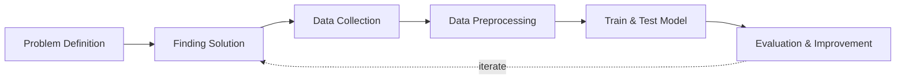

## Overview and Objective
This project, **developed in 2021**, aims to build an **automated web scraping system** to extract a diverse range of **financial data from the Indonesian Stock Exchange**. The system is designed to collect **financial reports, supporting documents, Excel tables, and XBRL files**. By automating this extraction process, the project intends to provide a **comprehensive and organized dataset** that facilitates **financial analysis, research, and reporting**, improving accessibility to essential financial information.

The **primary goal** is to develop a **robust scraping system** capable of **automatically gathering and organizing financial data** using **multi-threading or multiprocessing techniques** for enhanced efficiency. While the long-term vision includes deeper analytics, the **current scope is limited to data collection only**.

## Motivation and Inspiration
My **passion for financial markets** and data-driven research led me to explore the Indonesian stock exchange as a starting point, due to its **transparent operations and accessible documentation**. While media outlets often provide **summarized data**, access to **comprehensive historical datasets** is frequently locked behind **expensive subscriptions**—a barrier I sought to overcome.

Manually accessing financial records is **time-consuming and inefficient**. Motivated by the need for a scalable and cost-effective solution, I decided to **develop an automation bot** to collect extensive financial data. This project not only **streamlines the data collection process**, but also supports **informed decision-making and deeper market analysis**, especially for individuals or researchers who lack access to premium data services.

## Workflow
Below is the workflow on how my project works

1. Problem Definition
   - Clearly define the problem that needs to be solved.

2. Finding Solution
   - List all potential solutions and select one for implementation.
   - Develop a plan that outlines the expected outcomes.

3. Data Collection
   - Gather and prepare relevant datasets aligned with the problem.  
   - If batch datasets are unavailable, develop a data collection process like web scraping.  
   - Ensure data quality and resolve any data issues.

4. Continuous Updates
   - Regularly update the dataset or as needed.

5. Evaluation & Improvement
   - Evaluate inputs, processes, outputs, and outcomes.  
   - Identify challenges.  
   - Gain insights.  
   - Implement necessary improvements by addressing challenges, adding new features, or refining results based on evaluation feedback.  
   - Develop a plan for future enhancements.

## Solution and Technology Stack
Used tools:
1. Python libraries: TensorFlow, OpenCV, scikit-learn, NumPy, labelImg2. Hardware : Laptop Acer Predator Helios 300, Intel-12700H, 48 GB Ram, Gen4 SSD, RTX3070Ti Laptop GPU, 8 GB Vram

## Project Details and Results
1. Data Collection Automation
   
   - When I first developed this bot, I started with a single instance, facing the challenge of slow data mining. The bot performed a series of tasks, including launching Chromedriver, navigating to the website (https://www.idx.co.id/id/perusahaan-tercatat/laporan-keuangan-dan-tahunan), entering keywords into the search tab, selecting the year and quarter, clicking “search”/“apply,” downloading files, and saving them in a temporary directory. The final step involved renaming the file from the temporary path and moving it to a new location with an organized folder structure.
     - Below is the website preview
       
       
       
- Single bot
       
       
       
- Results
       
       

         
         
       

       
- In the second approach, I created a **multi-threaded bot capable of activating 10 bots simultaneously**, each handling a different task. This setup allowed me to **gather over 10,000 files annually**, significantly enhancing efficiency and productivity.
     - Multi-threaded bot
       
       
       
- Results
       
       
       
- As you may know, the website only provides data from the last 5 years. However, I was fortunate to extract financial reports dating back to 2015 by employing an **HTML injection script**. Unfortunately, this method is no longer feasible.

     
     
2. Files Check
   After downloading all the financial report documents, I need to verify the bot's performance to ensure completeness and accuracy.
   
   

## Challenges
1. **Data Collection Speed:** Data collection was initially slow due to using only a single bot. Therefore, I developed a multi-threading bot capable of running simultaneously to increase efficiency.
2. **Network Constraints:** Network limitations can affect data quality and potentially cause system crashes. To mitigate this, I need to limit the number of bots running concurrently.
3. **Handling Pop-Up Messages:** Occasionally, pop-ups appear during the process, which needs to be managed effectively.
4. **Data Quality:** Ensuring the accuracy and completeness of the scraped data, and addressing inconsistencies or errors in source documents.
5. **Website Changes:** Adapting to changes in website structure and data formats, which can impact the scraping process and require continuous maintenance.

## Insights
1. **Parallel Exploration:** Multiprocessing enables the launch of multiple browser instances simultaneously, each performing independent scraping tasks. This parallelism can significantly reduce overall execution time, especially when tasks involve loading multiple web pages or downloading large volumes of data.
2. **Browser Instance Management:** Controlling the number of concurrent browser instances to match the available CPU cores prevents overloading and ensures optimal performance.
3. **Driver Configuration:** Carefully configure each WebDriver instance, including options such as headless mode, to reduce visual load and save resources.
4. **Task Allocation:** Distribute data or tasks evenly across processes. For example, each process can handle a portion of URLs or a range of search keywords. Proper workload balancing prevents some processes from finishing too quickly while others lag behind.
5. **Shared Data Handling:** If data needs to be shared among processes, use multiprocessing queues or shared memory constructs. Avoid using global variables, as they are not shared across processes.
6. **Failure Management:** Websites may block or limit requests if bot-like behavior is detected. Implementing try-except blocks and setting up automatic retries for failed requests can help ensure resilience.
7. **WebDriver Timeouts:** Set appropriate timeouts for WebDriver operations to prevent processes from hanging indefinitely due to slow-loading pages or network issues.
8. **Browser and WebDriver Compatibility:** Ensure compatibility between the browser and the corresponding WebDriver versions. Version mismatches can lead to unexpected failures.
9. **Scalability:** Designing the system to handle large volumes of data and support scalability will ensure its effectiveness as data needs grow.
10. **Open Data Sources:** Public companies often provide open datasets containing valuable insights about activities, strategies, financials, and more. Leveraging these sources can enrich the analytical capabilities of the system.

## Future Plans
1. **Expanding Data Sources:** Enhancing the system to capture financial data from additional exchanges and financial databases, thereby broadening the scope and depth of available information.
2. **Improving Data Processing:** Developing advanced tools to process and clean the collected data, ensuring it is fully prepared for analysis and integration into financial models or reports.
3. **Implementing User Interfaces:** Creating intuitive interfaces for managing and visualizing the collected data, enabling users to easily access and interact with the information.
4. **Automating Updates:** Establishing an automated schedule for routine data retrieval and updates, ensuring financial information remains current and relevant.
5. **Developing Table Extraction:** Building robust table extraction capabilities to capture all valuable information from PDF documents related to each company, utilizing AI and OCR technologies.
6. **Building a Comprehensive Analytical Workflow:** Designing a complete analytical workflow to assess company performance by evaluating both quantitative and qualitative data.

## Real World Use Cases
1. **Democratizing Financial Research for Independent Analysts and Students:** This project enables individuals—especially students, researchers, and independent investors—to access rich, historical financial data without the barrier of expensive data subscriptions. By automating data collection from official stock exchange sources, it opens doors to meaningful research and learning opportunities, fostering financial literacy and data-driven thinking.
2. **Building Localized Financial Analytics Tools and Dashboards:** Developers and startups can use the extracted data as a foundation to create localized tools for Indonesian market analysis—such as stock screeners, financial dashboards, or risk-assessment apps—tailored to the unique structure and trends of the local market.
3. **Supporting Economic Journalism and Investigative Reporting:** Journalists and watchdog organizations can leverage this system to monitor changes in financial statements, detect anomalies, and hold companies accountable. The system simplifies the process of accessing raw filings and structured data like XBRL, allowing for deeper, evidence-based reporting.
4. **Enhancing Algorithmic Trading Models with Historical Insights:** Quantitative researchers and algorithmic traders can use the compiled dataset to backtest strategies based on real financial disclosures, gaining a deeper understanding of market behavior over time without relying on expensive commercial data providers.
5. **Automated Compliance and Due Diligence for SMEs and Financial Advisors:** Financial professionals and small advisory firms can use this tool to monitor clients’ investment portfolios or perform quick due diligence by automatically gathering the latest financial disclosures from public companies, streamlining reporting and compliance workflows.
6. **Foundation for AI-Driven Financial Forecasting or NLP Projects:** The scraped textual and tabular data, including PDFs and XBRL filings, can be fed into machine learning models for tasks such as sentiment analysis, anomaly detection, or financial forecasting—fueling AI research and fintech innovation specific to Southeast Asian markets.
