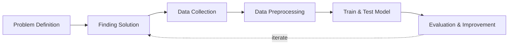

## Overview and Objective
This project, initiated in **2021**, aims to develop a **computer vision system capable of detecting and localizing lungs** in medical images such as **CXR (Chest X-Ray)** or **CT scans**. By **accurately identifying the lung boundaries**, the model will lay the foundation for further analysis, including **detecting lung diseases like Covid-19**. This detection system represents the **first step in building a more comprehensive tool** for diagnosing and monitoring various conditions affecting **internal organs**.

The **primary goal** is to create a **reliable computer vision model** that can **accurately detect lungs** in medical images. This system will not only assist in **lung health analysis** but will also serve as a **basis for detecting other internal organs**, enabling more **comprehensive diagnostic capabilities** for a range of medical conditions. However, for now, the project's focus remains solely on **lung detection**.


## Motivation and Inspiration
The **Covid-19 pandemic** served as the **primary catalyst** for this project. Witnessing the **global impact** of the virus and the **urgent need for advanced diagnostic tools** inspired me to contribute to the development of a **scalable and accurate detection system**. This project represents a **foundational step toward creating a Covid-19 detection model** by focusing on **lung detection in X-ray images**. **Accurate lung detection** is crucial for **isolating the target area**, enabling more **precise and efficient model training** for disease identification.

Moreover, this project is not only a step toward Covid-19 detection but also a **proof of concept** demonstrating the **potential of deep learning in medical imaging**. It shows that **specific organs or objects within the human body can be accurately detected** through **CXR or other X-ray images** if the model is trained with appropriate data. This capability has **far-reaching implications beyond Covid-19**, paving the way for **detecting various other conditions and abnormalities** in **multiple organs**. It enhances the **effectiveness of diagnostic tools** and supports advancements in **personalized medicine**.


## Workflow
Below is the workflow on how my project works



1. Problem Definition
   - Clearly define the problem that needs to be solved.

2. Finding Solution
   - List all potential solutions and choose one to implement.
   - Set objectives (e.g., classification accuracy, minimizing prediction errors) and constraints (e.g., time, hardware limitations).
   - Create a plan outlining the expected outcomes.

3. Data Collection
   - Gather and prepare a relevant dataset aligned with the problem.

4. Data Preprocessing
   - Split the data into training, validation, and test sets.
   - Perform labeling or annotation where necessary.

5. Train & Test Model
   - Choose a deep learning model architecture based on the problem (e.g., CNN for images, RNN/LSTM for sequential data, Transformer for NLP).
   - Train the model, setting targets for accuracy, loss, and other performance metrics.
   - Test the model using the test dataset to evaluate its performance.
   - Conduct real-world testing with external datasets to ensure the model's accuracy and applicability.

6. Evaluation & Improvement
   - Evaluate inputs, processes, outputs, and outcomes.
   - Identify challenges.
   - Discover insights.
   - Make necessary improvements by addressing challenges, adding new features, or refining results based on evaluation feedback.
   - Set a plan for future developments.


## Solution and Technology Stack
Used tools:
1. TensorFlow Object Detection API
2. Pretrained Model
3. Python libraries: TensorFlow, OpenCV, scikit-learn, NumPy, labelImg4. Hardware : Laptop Acer Predator Helios 300, Intel-12700H, 48 GB Ram, Gen4 SSD, RTX3070Ti Laptop GPU, 8 GB Vram


## Project Details and Results
1. Data Collection
   
   The dataset utilizing NIH Chest X-ray [link](https://www.kaggle.com/datasets/nih-chest-xrays/data) contains over 112,000 Chest X-ray images from more than 30,000 unique patients. I have used only **400 images** as a sample, which is considered sufficient for single-object detection.

2. Labelling

   Image labeling using LabelImg in Python involves manually annotating images by drawing bounding boxes around objects of interest and saving the coordinates and class labels in XML.
   
   
   
3. Generate Training Records

   TFRecords generation in Python involves converting datasets, such as images and annotations, into a serialized binary format optimized for TensorFlow, enabling efficient data storage and access during model training and evaluation.
   ```sh
   import pathlib

   MAIN_PATH = str(pathlib.Path().resolve())
   WORKSPACE_PATH = MAIN_PATH + "\\workspace"
   SCRIPTS_PATH = MAIN_PATH + "\\scripts"
   ANNOTATION_PATH = WORKSPACE_PATH + "\\annotations"
   IMAGE_PATH = WORKSPACE_PATH + "\\images"
   ```

   ```sh
   labels = [
       {"name" : "lung", "id" : 1}
   ]

   with open(ANNOTATION_PATH + "\label_map.pbtxt", "w") as f:
       for label in labels:
           f.write("item { \n")
           f.write("\tname:\"{}\"\n".format(label["name"]))
           f.write("\tid:{}\n".format(label["id"]))
           f.write("}\n")
   ```

   
   ```sh
   !python {SCRIPTS_PATH + "\\generate_tfrecord.py"} -x {IMAGE_PATH + "\\train"} -l {ANNOTATION_PATH + "\\label_map.pbtxt"} -o {ANNOTATION_PATH + "\\train.record"}
   !python {SCRIPTS_PATH + "\\generate_tfrecord.py"} -x {IMAGE_PATH + "\\test"} -l {ANNOTATION_PATH + "\\label_map.pbtxt"} -o {ANNOTATION_PATH + "\\test.record"}
   ```

   

   
4. Training Model using TensorFlow OD API

   - The TensorFlow object detection API was downloaded from this repository: [TensorFlow Models](https://github.com/tensorflow/models/tree/master/research/object_detection).
   - The pre-trained models were downloaded from this repository: [TF2 Detection Model Zoo](https://github.com/tensorflow/models/blob/master/research/object_detection/g3doc/tf2_detection_zoo.md).

   In this section, the dataset was trained to detect lungs as an object, and the trained model was saved by following these steps:

    - Generate the training command using this code.
      
      ```sh
      APIMODEL_PATH = "\\TensorFlow\\models" # set up your own path
      WORKSPACE_PATH = MAIN_PATH + "\\workspace"
      MODEL_PATH =  WORKSPACE_PATH + "\\models"
      CUSTOM_MODEL_NAME = "my_ssd_mobnet" # used pre-trained model
      n = 5000
      ```
      
      ```sh
      print("""python {}\\research\\object_detection\\model_main_tf2.py --model_dir={}\\{} --pipeline_config_path={}\\{}\\pipeline.config --num_train_steps={}""".format(APIMODEL_PATH, MODEL_PATH, CUSTOM_MODEL_NAME, MODEL_PATH, CUSTOM_MODEL_NAME, n))
      ```
      
- Copy and paste the training command into the command prompt, then press enter to start the training process.
      
      
      
- Training process

      
      
- Once training is complete, you can check the trained model as shown below. This model can be used to perform various detection tasks.
  
      
      
5. Detection Test
   
   The actual testing will use images different from those used in training. In this step, the code will attempt to detect 1,000 images, generating bounding boxes, labels, and detection scores on the images. You can review the detection results below.
   
   
   
6. Cropping Test

   This is an image cropping test using the trained model. You can find the results below.

   


## Challenges
1. **Data Labeling:** Acquiring accurately labeled medical images, particularly with precise lung boundaries, is challenging due to the specific expertise required.
2. **Anatomical Variation:** The size, shape, and position of lungs can vary significantly among individuals, making it difficult to generalize across the population.
3. **Limited Training Data:** The availability of medical images for training may be limited, which can impact the robustness of the model.


## Insights
1. **Adaptability:** The techniques developed for lung detection can be adapted to other internal organs such as the heart, liver, or kidneys, providing a versatile tool for broader medical applications.
2. **Radiologist Collaboration:** Collaborating with medical experts offers valuable insights into key anatomical markers for accurate lung detection, enhancing the model’s precision.
3. **Feature Localization:** The model’s ability to highlight specific areas within the lungs can assist doctors in identifying anomalies such as tumors, infections, or structural changes.


## Future Plans
1. **Expand Organ Detection:** Build upon this foundation to detect other internal organs in medical images, such as the liver, kidneys, and heart, enabling a comprehensive diagnostic system for various health conditions.
2. **Real-Time Diagnostics:** Develop a web-based platform where doctors can upload images for real-time lung detection and analysis, enhancing efficiency in clinical settings.
3. **Enhanced Lung Disease Detection:** Extend the model to detect diseases like pneumonia, lung cancer, and eventually Covid-19 by training the system to recognize specific pathological features.
4. **Improved Model Accuracy:** Continuously refine the model by incorporating larger and more diverse datasets, and integrating advanced deep learning techniques like attention mechanisms and U-Net architectures for better segmentation.


## Real World Use Cases

1. **Supporting Radiologists in Hospital Triage:** Acting as a complementary tool, this model helps radiologists focus their expertise where it matters most by highlighting lung regions in chest X-rays, accelerating diagnosis during critical times without replacing human judgment.
2. **Enhancing Diagnostic Pre-Screening:** As an assistive technology, it empowers clinicians to better prioritize cases by flagging potential abnormalities early, fostering a collaborative partnership between AI insights and medical experience.
3. **Extending Healthcare Reach to Underserved Areas:** By integrating into portable or telemedicine devices, this tool amplifies the capabilities of healthcare providers in remote regions, enabling earlier detection and care without substituting the vital human touch.
4. **Augmenting Medical Imaging Systems:** Embedded within larger platforms, it serves as a foundational step in refining diagnostic workflows—preparing images for deeper analysis—while recognizing that true understanding requires human interpretation.
5. **A Foundation for Holistic Organ Detection:** Beyond lungs, this approach lays groundwork for future AI tools that assist in identifying various organ-specific conditions, reflecting the ongoing partnership between human wisdom and machine precision to advance personalized healthcare.
