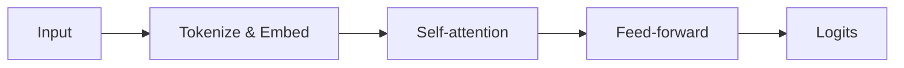

## LaTeX inline math

Energy and mass relate via Einstein's classic $E = mc^2$. The probability
density of a normal distribution: $f(x) = \frac{1}{\sigma\sqrt{2\pi}} e^{-\frac{1}{2}(\frac{x-\mu}{\sigma})^2}$.

## Display math

The cross-entropy loss for a classifier with $K$ classes:

$$
\mathcal{L} = -\sum_{i=1}^{N} \sum_{k=1}^{K} y_{i,k} \log \hat{y}_{i,k}
$$

A matrix multiplication identity:

$$
(AB)^\top = B^\top A^\top
$$

## Mermaid diagram



## Code block with highlighting

```python
import torch
import torch.nn.functional as F

def softmax_cross_entropy(logits, labels):
    return F.cross_entropy(logits, labels)
```

## Table

| Component | Purpose                       |
| --------- | ----------------------------- |
| Embedding | Map tokens to vectors         |
| Attention | Mix token representations     |
| FFN       | Per-token non-linear transform |
