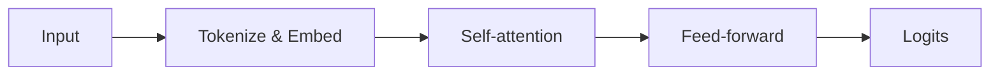

## LaTeX inline math

Energy and mass relate via $E = mc^2$. The density of a normal distribution:
$f(x) = \frac{1}{\sigma\sqrt{2\pi}} e^{-\frac{1}{2}(\frac{x-\mu}{\sigma})^2}$.

## Display math

Cross-entropy loss over $K$ classes:

$$
\mathcal{L} = -\sum_{i=1}^{N} \sum_{k=1}^{K} y_{i,k} \log \hat{y}_{i,k}
$$

$$
(AB)^\top = B^\top A^\top
$$

## Mermaid diagram



## Code block with highlighting

```python
import torch
import torch.nn.functional as F

def softmax_cross_entropy(logits, labels):
    return F.cross_entropy(logits, labels)
```

## Table

| Component | Purpose                        |
| --------- | ------------------------------ |
| Embedding | Map tokens to vectors          |
| Attention | Mix token representations      |
| FFN       | Per-token non-linear transform |
